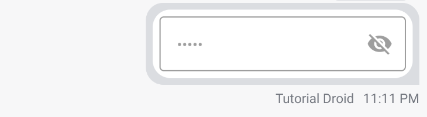
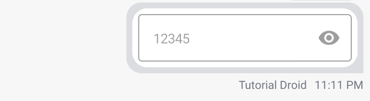
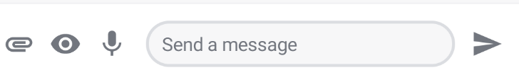
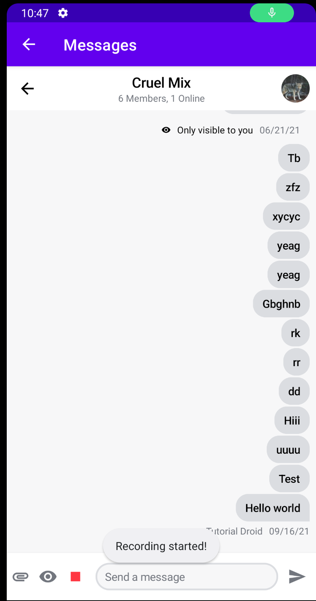
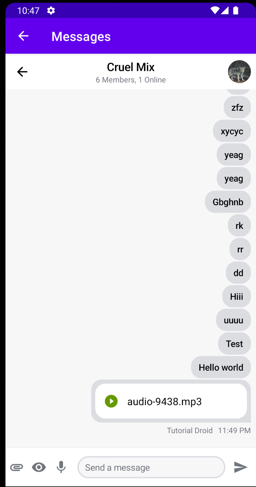
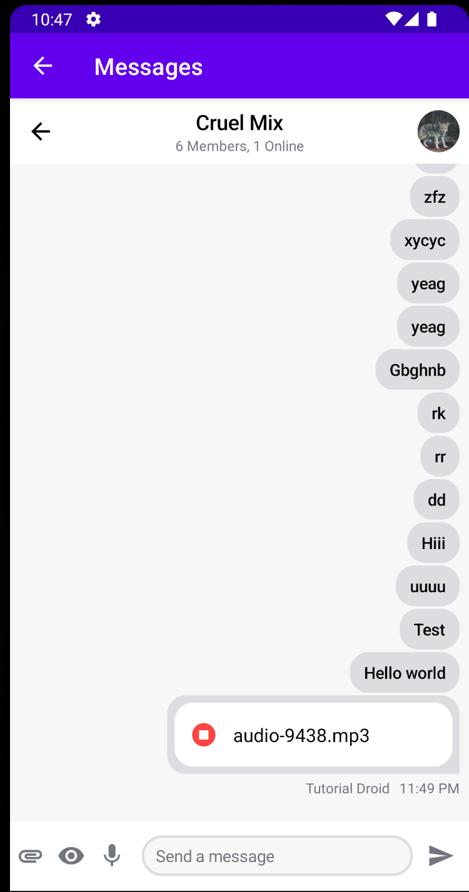
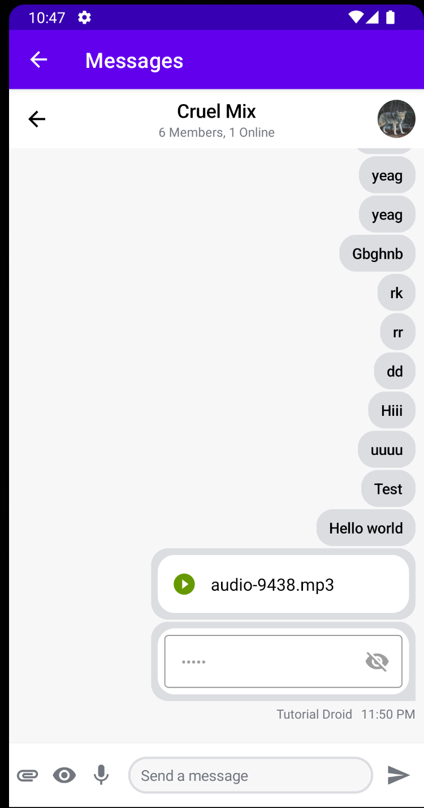

# Custom Attachments in Stream Compose SDK
## Introduction 

Stream recently [announced](https://getstream.io/blog/jetpack-compose-sdk/) their Jetpack Compose UI components which is currently in beta. This follows the announcement of the stable version of Jetpack Compose.

In this tutorial, you'll learn

- What is an `AttachmentFactory and creating a custom `AttachmentFactory`.
- Customizing Stream [Compose UI Components](https://getstream.io/chat/docs/sdk/android/compose/overview/)
- Sending custom files as attachments.
- Adding previews for your custom attachment.

**Note:** You can try out the new SDK by checking out the [Jetpack Compose Chat Tutorial](https://getstream.io/chat/compose/tutorial/) 

Stream Chat SDK supports several attachments by default for example images, URLs, gifs and videos. With the XML UI components, you could create a custom `AttachmentViewFactory` class that would be used to render your attachment preview. The good news is that even with the Compose UI components, you still have this ability :]

First, you'll need to understand what is an `Attachment Factory'

## Introduction to `AttachmentFactory`

This is a class that allows you to build and render your attachments to the list of messages. As earlier mentioned, Stream Chat SDK provides several default factories to transform images, files and link attachments.   You can get all the default factories using:

```kotlin
val defaultFactories = StreamAttachmentFactories.defaultFactories()
```

If your app needs attachments other than the ones provided by the default factories, you'll need to create your custom ones. This is what you'll be doing in the subsequent sections.

## Creating a Custom `AttachmentFactory`

To create a custom `AttachmentFactory`, you'll need:

- A view to show the attachment. In this case, it will be a composable.
- To create a new `AttachmentFactory`. Here you supply a predicate that checks for your custom attachment and specifies how to render the attachment content.

Before creating a custom `AttachmentFactory`, first, you'll need to create an `Attachment` object.

## Custom Password Attachment

You have this attachment that you'd want to send to a certain channel:

```kotlin
val attachment = Attachment(
    type = "password",
    extraData = mutableMapOf("password" to "12345"),
)
val message = Message(
    cid = channelId,
    attachments = mutableListOf(attachment),
)
```

This is a message with an attachment that contains a password. You pass the password through the `extraData` property. By default, the SDK doesn't know how to render this attachment content.

To render this, you'll start by creating a composable that shows your password. Here's how the code looks like:

```kotlin
// 1
@Composable
// 2
fun PasswordAttachmentView(attachmentState: AttachmentState) {
    // 3
    var showPassword by remember { mutableStateOf(false) }
    // 4
    val passwordAttachment = attachmentState.messageItem.message.attachments.first { it.type == "password" }
  
    Row(
        modifier = Modifier
            .padding(6.dp)
            .clip(ChatTheme.shapes.attachment)
            .background(Color.White)
    ) {
        // 5
        OutlinedTextField(
            value = passwordAttachment.extraData["password"].toString(),
            onValueChange = {},
            modifier = Modifier
                .fillMaxWidth()
                .padding(6.dp)
                .height(50.dp),
            enabled = false,
            visualTransformation = if (showPassword) VisualTransformation.None else PasswordVisualTransformation(),
            keyboardOptions = KeyboardOptions(keyboardType = KeyboardType.Number),
            trailingIcon = {
                val image = if (showPassword) Icons.Filled.Visibility else Icons.Filled.VisibilityOff

                IconButton(onClick = { showPassword = !showPassword }) {
                    Icon(imageVector = image, null)
                }
            }
        )
    }
}
```

Here's what the code above does:

1. Annotating the function using the `@Composable`  annotation. This lets you build the component's UI  with Compose as opposed to the previous way of using XML.
2. The function takes `AttachmentState`  as an argument. `AttachmentState` is a class that handles the state of the attachment. It has a `MessageItem` , `Modifier` and `onLongItemClick` handler. The `MessageItem` contains all the information about a particular attachment. You use the `Modifier` for things like the component size, padding, background, etc.
3. This stores `showPassword` value in memory of the composable by using the `remember` composable. This value triggers a recomposition of the composable when the value changes.
4. Looks for attachments whose `type` is password from the `AttachmentState`.
5. This is composable for handling user inputs.  In this scenario, you're using it to display your password attachment. You set the value of the `OutlinedTextField` by getting the `extraData` that was passed to the attachment. Notice that the `visualTransformation` and `trailingIcon` are dependent on the value of `showPassword`. This helps in toggling the password visibility.

You've built the view that will render your attachment content, next you'll create a custom `AttachmentFactory`  which is needed to show your attachment content.

## Creating Custom Password AttachmentFactory

To build your custom password message content, you have to create your own factory. This is how it will look like:

```kotlin
@ExperimentalStreamChatApi
val customAttachmentFactories: List<AttachmentFactory> = listOf(
     AttachmentFactory(
        canHandle = { attachments -> attachments.any { it.type == "password" } },
        content = @Composable { PasswordAttachmentView(it) }
    )
)
```

This is a list of attachment factories. Each `AttachmentFactory` has the following two properties:

- `canHandle` - a lambda function that accepts a list of attachments. You also specify what type of attachments the factory can handle. In this case, it's the attachments with `type` password.
- `content` - This specifies the composable that renders your password attachment content. This uses the `PasswordAttachmentView` composable that you created earlier.

With this done, the only remaining thing to do is to add this custom factory to the `ChatTheme`. To do this override the `attachmentFactories` in your `ChatTheme` wrapper:

```kotlin
ChatTheme(
    attachmentFactories = customAttachmentFactories + defaultFactories
)
```

Here, you override the default factories by providing your own custom factoring and also adding the `defaultFactories`.

Now when you send a message with a `type` password. This is how it appears on the Message List:



Tapping the password visibility icon, you'll see the password value:



The `showPassword` variable toggles the password content visibility. It also toggles the password visibility icon to changes depending on what is shown. This view will render all attachments with `type` password by default.

You've seen how to send attachments that don't have files. In the next section, you'll be learning how to record audio files and send them as custom attachments too.

## Custom Audio Attachment

Sending audio files is a much sort after feature in chat apps. With the Stream Chat SDK, you can send audio files as custom attachments. Similar to the password attachment, you'll need to:

- Create and send your custom attachment.
- Create a custom view for your attachment.
- Add your custom `AttachmentFactory`.

Here's the message with the attachment:

```kotlin
val attachment = Attachment(
    type = "audio",
    upload = File(output),
)
val message = Message(
    cid = channelId,
    attachments = mutableListOf(attachment),
)
```

For attachments with files, you have to use the `upload` property. It uploads your attachment. You can access the attachment using the `url` property of the attachment. You're using the `output` from `MediaRecorder`.The functionality of this can be found in the sample project.

You have your `Attachment` object ready, next,  you'll learn how to create a preview of the audio attachment content.

## Custom Audio Attachments View

For audio, you'll need a UI with a play functionality so that you can listen to the audio that has been sent. For playing you'll use the Android `MediaPlayer` for playing the audio file.

This is how you composable will be:

```kotlin
@Composable
fun AudioAttachmentView(attachmentState: AttachmentState) {
    // 1
    var playing by remember { mutableStateOf(false) }
    // 2
    val audioAttachment = attachmentState.messageItem.message.attachments.first { it.type == "audio" }
    // 3
    val player = PlayerWrapper(
        player = MediaPlayer.create(LocalContext.current, Uri.parse(audioAttachment.url)),
        onStop = { playing = false },
    )

    // 4
    DisposableEffect(Unit) {
        onDispose { player.release() }
    }

    ConstraintLayout(
        modifier = Modifier
            .fillMaxWidth()
            .padding(6.dp)
            .clip(ChatTheme.shapes.attachment)
            .background(Color.White)
    ) {
        val (iconButton, text) = createRefs()
        // 5
        IconButton(
            onClick = {
                playing = !playing
                if (playing) player.play() else player.stop()
            },
            modifier = Modifier
                .width(50.dp)
                .height(55.dp)
                .constrainAs(iconButton) {
                    start.linkTo(parent.start)
                    top.linkTo(parent.top)
                }
        ) {
            Image(
                painter = painterResource(
                    when (playing) {
                        true -> R.drawable.ic_baseline_stop_circle_24
                        false -> R.drawable.ic_baseline_play_circle_filled_24
                    }
                ),
                contentDescription = "Play Icon",
            )
        }
        val fileName = audioAttachment.name ?: ""
        // 6
        Text(
            text = fileName,
            fontSize = 16.sp,
            modifier = Modifier
                .constrainAs(text) {
                    start.linkTo(iconButton.end)
                    top.linkTo(iconButton.top)
                    bottom.linkTo(iconButton.bottom)
                }
        )
    }
}
```

To explain the code above:

1. This is another state variable that tracks the playing state. It helps in toggling between the play and stop icons.
2. Gets the audio attachment from `AttachmentState`.
3. You're creating a `PlayerWrapper` instance. It has utility methods for playing, stopping and releasing the `MediaPlayer`. You also pass the audio file as URI.
4. This calls the `release()` function from `PlayerWrapper` class to clean up the  `MediaPlayer`. This ensures your composable doesn't have any side-effects and the `PlayerWrapper` is cleaned up when the composable leaves composition.
5. This is an `IconButton` composable that changes state depending on the state of the player. Tapping this plays the audio and shows the stop icon. Tapping the stop icon will stop the audio.
6. This is a composable which shows the name of the file.

You have the preview ready, you'll be creating a custom messages screen that has a record button at the bottom.

## Customizing the Messages Screen

With the new Compose UI components, it's easy for you to add chat features to your app and customize these components to your needs. You'll be learning how to customize some of these components in the next few sections.

For the Audio recording functionality, you'd want to add a record icon on your message input layout  as:



In the above image, notice there's the password icon that sends the password attachment that you've learned. There's also a microphone icon that will have all the recording functionality.

To have such a UI you'll begin by customizing your Messages Screen as:

```kotlin
ChatTheme(
    attachmentFactories = customAttachmentFactories + defaultFactories
) {
    CustomUi { onBackPressed() }
}
```

Here, you use the `ChatTheme` from Stream Compose UI elements. It provides you with all the default styling. You can also choose to use a custom theme if you need different styling.  You also pass your custom factories to handle the custom attachments. And lastly, you set the content to a custom one. If you need the default channel messages behavior you only need to do this:

```kotlin
ChatTheme {
    MessagesScreen(
        channelId = channelId,
        messageLimit = 30,
        onBackPressed = { finish() }
    )
```

You're adding the functionality with a few lines on code :] But for now, you'll not be using the `MessagesScreen` component. Instead you'll build a custom one with the following code:

```kotlin
@Composable
    fun CustomUi(onBackPressed: () -> Unit) {
        val isShowingAttachments = attachmentsPickerViewModel.isShowingAttachments
        val selectedMessage = listViewModel.currentMessagesState.selectedMessage
        val user by listViewModel.user.collectAsState()

        Box(modifier = Modifier.fillMaxSize()) {
            Scaffold(
                modifier = Modifier.fillMaxSize(),
                bottomBar = {
                    CustomAudioComposer()
                },
                content = {
                    Column(modifier = Modifier.fillMaxSize()) {
                        MessageListHeader(
                            channel = listViewModel.channel,
                            currentUser = user,
                            isNetworkAvailable = true,
                            messageMode = listViewModel.messageMode,
                            modifier = Modifier
                                .fillMaxWidth()
                                .height(56.dp),
                            onBackPressed = onBackPressed,
                            onHeaderActionClick = {},
                        )

                        MessageList(
                            modifier = Modifier
                                .padding(it)
                                .background(ChatTheme.colors.appBackground),
                            viewModel = listViewModel,
                            onThreadClick = { message ->
                                composerViewModel.setMessageMode(Thread(message))
                                listViewModel.openMessageThread(message)
                            }
                        )
                    }
                }
            )

            if (isShowingAttachments) {
                AttachmentsPicker(
                    attachmentsPickerViewModel = attachmentsPickerViewModel,
                    modifier = Modifier
                        .align(Alignment.BottomCenter)
                        .height(350.dp),
                    onAttachmentsSelected = { attachments ->
                        attachmentsPickerViewModel.changeAttachmentState(false)
                        composerViewModel.addSelectedAttachments(attachments)
                    },
                    onDismiss = {
                        attachmentsPickerViewModel.changeAttachmentState(false)
                        attachmentsPickerViewModel.dismissAttachments()
                    }
                )
            }

            if (selectedMessage != null) {
                SelectedMessageOverlay(
                    messageOptions = defaultMessageOptions(
                        selectedMessage,
                        user,
                        listViewModel.isInThread
                    ),
                    message = selectedMessage,
                    onMessageAction = { action ->
                        composerViewModel.performMessageAction(action)
                        listViewModel.performMessageAction(action)
                    },
                    onDismiss = { listViewModel.removeOverlay() }
                )
            }
        }
    }
```

Some of the code from the `CustomMessageScreen` is omitted for brevity purposes. To explain the key components in the `CustomUi` composable, first, you're defining the parent layout which is `Box` and `Scaffold`. `Box` layout allows you to show things on top of each other. `Scaffold` is a material design layout structure that provides you an easier way to add different material components like app bar, bottom navigation and content. In the `Scaffold` you define:

- `bottomBar` - This is the bottom bar with a `MessageComposer` for sending messages and attachments. By default, it only has the attachment icon. You'll be adding other icons and their actions too. You'll see the contents of `CustomAudioComposer` in a moment.
- `content` - This has the contents of the rest of the screen. You have a `Column` with a `MessageListHeader` and a `MessageList`. `MessageListHeader` shows the back button, channels information like members online and shows an avatar of the current user. `MessageList` component shows messages of the selected channel.  These two components are customizable depending on what information you want to display.

Next, you'll dive deep into the `CustomAudioComposer` component to see how you can add custom actions to `MessageComposer`.

## Creating a Custom Message Composer

`MessageComposer` allows a user to type and send messages, add and send attachments too. 

```kotlin
@Composable
    fun CustomAudioComposer() {
        val buttonState by stateViewModel.isRecording.collectAsState()
        MessageComposer(
            modifier = Modifier
                .fillMaxWidth()
                .wrapContentHeight(),
            viewModel = composerViewModel,
            // 1
            integrations = {
                IconButton(
                    modifier = Modifier
                        .align(Alignment.CenterVertically)
                        .width(35.dp)
                        .height(35.dp)
                        .padding(4.dp),
                    content = {
                        Icon(
                            imageVector = Icons.Default.Attachment,
                            contentDescription = null,
                            tint = ChatTheme.colors.textLowEmphasis,
                        )
                    },
                    onClick = {
                        attachmentsPickerViewModel.changeAttachmentState(true)
                    }
                )
                IconButton(
                    onClick = {
                        sendPasswordAttachmentMessage()
                    },
                    modifier = Modifier
                        .width(35.dp)
                        .height(35.dp)
                        .padding(4.dp)
                ) {
                    Icon(
                        imageVector = Icons.Default.Visibility,
                        contentDescription = null,
                        tint = ChatTheme.colors.textLowEmphasis,
                    )
                }
                IconButton(
                    onClick = {
                        if (!buttonState) {
                            checkPermissions()
                        } else {
                            stopRecording()
                        }
                    },
                    modifier = Modifier
                        .width(35.dp)
                        .height(35.dp)
                        .padding(4.dp)
                ) {
                    Icon(
                        imageVector = if (buttonState) {
                            Icons.Default.Stop
                        } else Icons.Default.Mic,
                        contentDescription = null,
                        tint = if (buttonState) ChatTheme.colors.errorAccent else ChatTheme.colors.textLowEmphasis,
                    )
                }
            },
            // 2
            input = {
                MessageInput(
                    modifier = Modifier
                        .fillMaxWidth()
                        .weight(7f)
                        .padding(start = 8.dp),
                    value = composerViewModel.input,
                    attachments = composerViewModel.selectedAttachments,
                    activeAction = composerViewModel.activeAction,
                    onValueChange = { composerViewModel.setMessageInput(it) },
                    onAttachmentRemoved = { composerViewModel.removeSelectedAttachment(it) },
                )
            }
        )
    }
```

This is the `CustomAudioComposer` with the following two key components:

1. `integrations` - You use this to provide attachment integrations. By default, there are the image, file and media capture attachments. In this custom one, there are three integrations: the default one, then there's an `IconButton` for password integration. And lastly, there's an `IconButton` for a microphone which represents audio integration. With these `IconButton`'s you provide custom actions to handle them when they're tapped. In this case, it's the sending of passwords and audio attachments. That's all you need to have custom integrations.
2. `input`  - This has a `MessageInput` component where user can type their messages.

And that's all you need to have your custom messages screen with custom integrations. With this, once you run the app, your `MessageComposer` will be as follows:


When you tap on the microphone icon, you'll see a `Toast` with "Recording started!" message.



When you tap `Stop`  the recording will stop and uploading of your audio file starts.



The custom factory will render your audio attachment which shows the audio name and a Play icon. When you tap play, your audio starts playing:



You can see the icon changes the color and shows stop icon now which on tapping will stop the audio.

This is how the two custom attachments look like:



Congratulations! You've learned how to add custom attachments with files and without files. Now, you can enhance your chat application with all these amazing custom features you've learned!

## Conclusion

You've seen how easy it is to add custom attachments to Stream Compose UI components.  You can add as many custom attachments as your app supports.

The full sample project with examples in this tutorial [on GitHub](https://github.com/wangerekaharun/StreamComposeAttachments)

The [Compose SDK](https://getstream.io/chat/docs/sdk/android/compose/overview/) is still in beta. In case you have any feedback on using the SDK, reach the team [on Twitter](https://twitter.com/getstream_io) and [on GitHub](https://github.com/GetStream/stream-chat-android).

